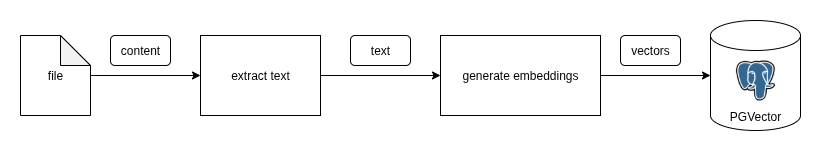
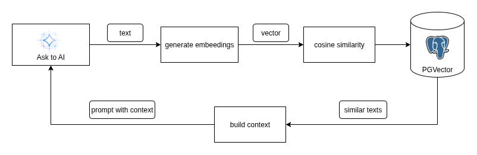

# LLM-RAG

[](https://www.python.org/)
[](https://ollama.ai/)
[](https://github.com/pgvector/pgvector)
[](https://opensource.org/licenses/MIT)

## 🔍 Overview

A Python implementation of RAG (Retrieval Augmented Generation) using Ollama and PGVector for enhanced AI responses with PDF-based knowledge.

## 📋 Summary

- [Overview](#overview)
- [Features](#features)
- [Architecture](#architecture)
- [Installation](#installation)
- [Usage](#usage)
- [Example](#example)

## ✨ Features

- PDF document processing and text extraction
- Automatic text chunking and embedding generation
- Vector storage using PostgreSQL with pgvector extension
- Semantic search
- Integration with Ollama LLM for response generation
- Docker-based setup for easy deployment

## 📦 Requirements

- Python 3.11 or higher
- Docker and Docker Compose
- Ollama (for LLM inference)
- PostgreSQL with pgvector extension


## RAG (Retrieval Augmented Generation)

RAG  is a technique to store data as embeddings in a vector database and query similar content to generate context for AI interactions. This implementation uses Ollama for the language model and PGVector for efficient vector storage and similarity search.

#### 🏗️ Architecture

The RAG process is divided into two main steps:

###### 1. Knowledge Base Creation



- PDF documents (or any other file) are processed to extract text and split into chunks
- Each chunk is converted into embeddings (numerical representations)
- Chunks and embeddings are stored in a vector database (PGVector)

###### 2. Query Processing



- A user question is converted to embeddings
- The embeddings are used to find similar content in the vector database
- The similar content is used to create a context for the question that will be sent to the AI model
- The AI model generates a response based on the context

## 🚀 Installation

1. **Clone the repository**

```bash
git clone https://github.com/yourusername/llm-rag.git
cd llm-rag
```

2. **Install dependencies**

<span style="color: gray">*make sure to install this dependencies in a virtual environment.*</span>

```bash
pip install -r requirements.txt
```

3. **Start PGVector database using Docker**

```bash
cd infra && docker compose up -d
```

## 💻 Usage

##### 1. Create a knowledge base from a PDF file

```bash
python -m src.knowledge_base --path examples/byd-seal.pdf
```

##### 2. Run the AI assistant with a query

```bash
python -m src.main "What is motor model?"

# AI: Based on the provided document, the BYD Seal features a high-performance permanent magnet synchronous motor model.
```